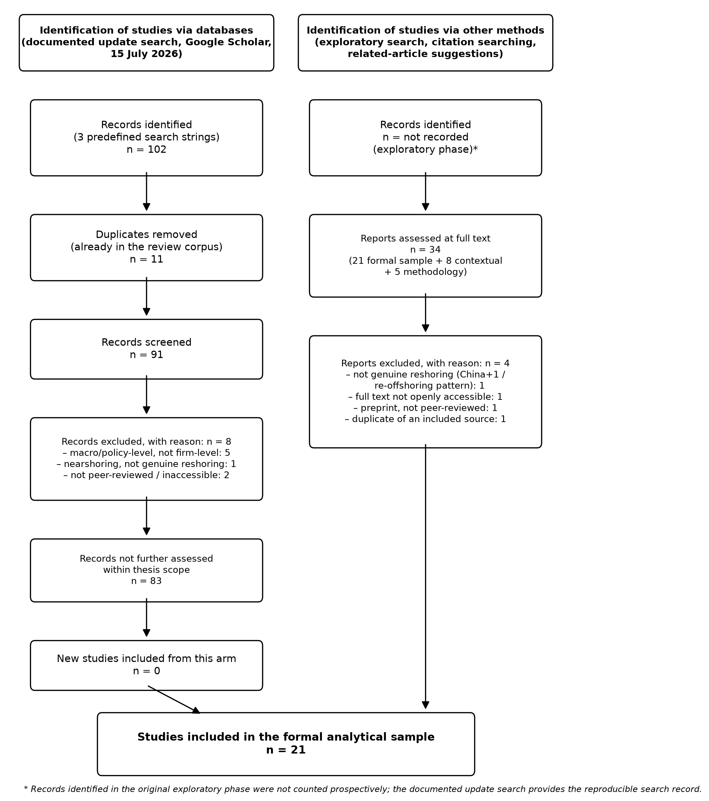

# 3 Research Methodology

This chapter outlines the design and implementation of the thesis and discusses the rationale for conducting a systematic literature review for the thesis' research questions, the process of collecting and screening the source material, quality assessment of the included evidence, and the analysis of the collected evidence in order to create the framework of barriers at the firm-level. The chapter ends with methodological weaknesses of the method.

## 3.1 Research Design

This thesis uses a research method called systematic literature review (SLR). The choice is natural as the nature of the research question is to diagnose the barriers that manufacturing companies encounter when implementing reshoring strategies from Asian markets and its subsequent implications for the manager. These questions can be answered without making new primary observations, but rather a structured analysis and synthesis of evidence that is already available in a dispersed form. A systematic review is the right review to conduct as it synthesises the results of literature about a bounded question by using explicit, documented and reproducible methods of literature search, selection and analysis (Snyder, 2019).

Snyder (2019) indicates that a literature review itself can be used as a research method and there are three types of literature review: systematic, semi-systematic, and integrative, which can be used for a variety of purposes. If a question is specific enough to be answered by locating and assessing a set of relevant studies using a set of criteria, then a systematic review is appropriate. The research question in the present research is specific and set at the firm level, which makes a systematic design the most suitable of the three, despite the methodological diversity of the evidence. The rest of the chapter is organized in four phases of the review process outlined by Snyder (2019): designing the review, conducting the review, analyzing the review and writing the review. The framework is used here in its general form as a methodological reason, and reporting and synthesis guidance is provided in the following sections.

For this design, the thesis does not compile primary interview, survey or company evidence, but only uses evidence that has already been published by others and subjected to peer-review. This contribution is integrative as the review combines the results of the individual studies in a single framework of reshoring implementation barriers that is consistent with literature review-based work in the reshoring field (Tsai & Urmetzer, 2024). This design will allow the research questions to be addressed directly and will make the source and weight of each piece of evidence clear.

## 3.2 Data Collection Methods

The literature search and selection was documented using the PRISMA 2020 reporting guidelines (Page, McKenzie, et al., 2021; Page, Moher, et al., 2021), which were not used as a tool of evidence synthesis, but rather as a tool to report on identification, screening, and inclusion. There was only a single literature-discovery tool: Google Scholar. The literature search started in late June 2026 and concluded in the following few weeks, and included a combination of topic-related terms, backward and forward citation searches, and the "related articles" features in Google Scholar: reshoring, backshoring, manufacturing reshoring, reshoring barriers, reshoring implementation, and terms related to supplier dependence, capabilities, and transfer of production. This process was exploratory, not based on a pre-defined list of search strings, and was not prospectively documented, so there are no definitive strings or number of results reported. This process, by the beginning of July, had resulted in the bulk of the literature utilized for this thesis.

A final documented update search was conducted on 15 July 2026 in Google Scholar, to increase the transparency of the search process. The three predefined strings were run with the results recorded as they occurred: search date, exact string, results shown, records screened and exclusions noted with reasons. This was merely a review of the current stock but not the beginning of literature search. 102 records were screened across the three strings, of which 11 records matched with sources already in the corpus. Most others were not included, primarily because they were either macro- or policy-level oriented, focused on nearshoring as opposed to genuine reshoring, or were not easily accessible or not peer-reviewed. There was no new source added due to this. Together with the full-text stage of the earlier search process, this update search provides the documented record of the study-selection process, which is summarised in the PRISMA 2020 flow diagram in Figure 1.

**Figure 1.** *PRISMA 2020 flow diagram of the study-selection process. The left arm reports the documented update search; the right arm reports the reconstructable full-text stage of the original exploratory search process.*

Duplicate entries were handled, and titles, abstracts, and available full text were then screened for eligibility based on the eligibility criteria. Google Scholar does not filter automatically by peer-review status, publication type or language, thus these were manually checked for all the candidate sources. Only sources in English language, and with full texts available online, were included and a source had to be relevant to manufacturing reshoring, and meet the thesis definition of reshoring to be included in the formal analytical sample.

Studies were required to address the actual reshoring process, the return of manufacturing to the company's home country. Barrier coding was not included for studies on China+1, China-to-Southeast-Asia relocation, re-offshoring, nearshoring without a return home, or foreign-to-foreign relocation because these are not considered to be a true reshoring; a few of these were included with contextual notes in the Introduction and Discussion. Asia specificity was not always reported in the literature as a specific host location, so was recorded as a rating for all sources used and only results relating to an explicit Asian host location with a return home are reported as Asia-specific in the Results.

A total of 34 sources are used for the corpus. The barrier framework is based on 21 peer-reviewed studies on reshoring. Further contextual and policy sources, such as macro level relocation patterns and the China+1 dynamics, are described in the Introduction and Discussion but were not coded at the barrier level as they reflect the broader environment but not the level of implementation of the barriers. The research design and coding and synthesis procedures have been justified by five methodology sources, and do not present any barrier evidence. The documented selection record thus only encompasses the 21 studies that form the formal analytical sample; the methodology sources are not counted and the contextual sources are reported separately. The 21 studies included in the formal analytical sample are: Bilbao-Ubillos et al. (2024); Boffelli et al. (2021); D'Ambrosio and Lavoratori (2025); Di Mauro et al. (2018); Di Stefano and Fratocchi (2019); Espíndola et al. (2023); Gupta et al. (2023); Heikkilä et al. (2018); Kamp and Gibaja (2021); Li et al. (2025); Mirzaei et al. (2021); Ocicka (2016); Pedroletti (2025); Pedroletti and Ciabuschi (2023); Pegoraro et al. (2022); Pourhejazy and Ashby (2021); Robinson and Hsieh (2016); Stentoft et al. (2025); Tsai and Urmetzer (2024); Wan et al. (2019); Wiesmann et al. (2017).

All the sources in the formal sample were also described in terms of two dimensions. The first specifies the kind of evidence that it gives, because it can be of different quality and has a different evidential status, and because it cannot be equated. The second is an Asia-specificity rating (high, medium, or low), assigned as high if the data or case in a source explicitly references an Asian host location and a return home. The two dimensions influenced the interpretation and reporting of the evidence throughout the thesis and referred to the extent to which the evidence was relevant and the nature of the evidence without addressing the methodological quality of each source. A single researcher conducted screening and selection; this is a limitation noted.

## 3.3 Data Analysis Techniques

The evidence that was included was analysed in an adapted way using a three-stage process of synthesising findings across studies developed by Thomas and Harden (2008). In the first phase, the findings of relevant studies in the included studies were coded on the level of meaningful evidence segments. The second stage involved grouping codes into descriptive categories, which remained close to the content of the main studies, when they were conceptually similar. In the third stage, descriptive themes were interpreted to generate higher-order analytical themes to answer the research questions and exceed those identified by any single study individually. One of the strengths of this procedure is that it allows for an audit trail to be kept from the conclusions made in the review to the original text of the primary studies, enabling each analytical theme to be followed through the descriptive themes to the coded evidence.

The coding itself was based on a deductive-inductive logic for which Mayring (2014) provides the methodological basis. Mayring (2014) considers qualitative content analysis as a systematic, rule-governed method in which the application of deductive categories and the development of inductive categories are not mutually exclusive. Based on this, the four categories of the thesis framework — regulatory/institutional, cultural/organisational, cost/operational and asset/capability — were deductively derived from the theoretical framework and the research questions and were used as an a priori coding frame. The included studies were then inductively clustered into more specific category themes within each of these general categories, and the boundaries of the categories were refined when the a priori frame did not adequately cover the coded material. The outcome was a set of barrier themes that were embedded in the four deductive categories. Table 1 documents this coding: each barrier theme, the category it belongs to, and the studies whose evidence was coded to it, separated by evidence type.

**Table 1.** *Coding of the barrier themes: each theme, its framework category, and the contributing studies by evidence type.*

| Barrier theme | Category | Direct empirical | Review | Conceptual |
|---|---|---|---|---|
| Host-country exit regulation | Regulatory/Institutional | Li et al. (2025) | Di Stefano & Fratocchi (2019) | — |
| Social-responsibility & workforce-resistance exit constraints | Regulatory/Institutional | — | Di Stefano & Fratocchi (2019) | — |
| Home-country compliance burden & institutional frictions | Regulatory/Institutional | Mirzaei et al. (2021) | — | Gupta et al. (2023) |
| Organisational readiness, behavioural biases, learning-by-trial | Cultural/Organisational | Boffelli et al. (2021) | Wiesmann et al. (2017) | D'Ambrosio & Lavoratori (2025) |
| Intra-organisational silos & weak employee involvement | Cultural/Organisational | Mirzaei et al. (2021) | — | — |
| Adverse host-supplier relational response | Cultural/Organisational | Pedroletti (2025) | — | — |
| Governance mode of the return (gap) | Cultural/Organisational | — | Pedroletti & Ciabuschi (2023) | — |
| Digital/organisational adaptation burden | Cultural/Organisational | — | Bilbao-Ubillos et al. (2024); Espíndola et al. (2023) | Gupta et al. (2023); D'Ambrosio & Lavoratori (2025) |
| Hollowed-out supply base / supplier-network rebuilding | Cost/Operational | Mirzaei et al. (2021); Di Mauro et al. (2018) | Wiesmann et al. (2017); Ocicka (2016) | Gupta et al. (2023) |
| New fixed costs & switching/reconfiguration costs | Cost/Operational | Li et al. (2025) | Espíndola et al. (2023) | D'Ambrosio & Lavoratori (2025); Gupta et al. (2023) |
| High-cost home environment | Cost/Operational | Mirzaei et al. (2021); Li et al. (2025) | — | D'Ambrosio & Lavoratori (2025) |
| Hybrid-operation coordination complexity (partial reshoring) | Cost/Operational | Pedroletti (2025) | — | — |
| Underestimated operational adjustments | Cost/Operational | Boffelli et al. (2021) | — | — |
| Domestic skilled-labour & competence gap | Asset/Capability | Pegoraro et al. (2022); Li et al. (2025); Di Mauro et al. (2018); Mirzaei et al. (2021) | Wiesmann et al. (2017); Ocicka (2016); Bilbao-Ubillos et al. (2024) | D'Ambrosio & Lavoratori (2025); Gupta et al. (2023) |
| Domestic capacity, facilities & machinery gap | Asset/Capability | Pegoraro et al. (2022); Li et al. (2025); Mirzaei et al. (2021) | Wiesmann et al. (2017) | D'Ambrosio & Lavoratori (2025); Gupta et al. (2023) |
| Host-supplier dependence & knowledge lock-in | Asset/Capability | Pedroletti (2025); Li et al. (2025) | Wiesmann et al. (2017); Bilbao-Ubillos et al. (2024) | Gupta et al. (2023) |
| GVC stickiness / offshore sunk-cost inertia | Asset/Capability | — | Bilbao-Ubillos et al. (2024) | D'Ambrosio & Lavoratori (2025) |
| Regional ecosystem readiness | Asset/Capability | Pegoraro et al. (2022) | Bilbao-Ubillos et al. (2024) | — |

The full source-by-source coding records, including the per-source evidence-type notes, are provided in the Appendix.

The integrity of the synthesis was safeguarded by two coding rules. First, and consistent with the decision rule of the corpus, the three types of evidence (direct findings from the study's data, findings reported by the literature survey, and barriers argued on conceptual grounds) were coded as separate evidence types and reported separately without being combined into a single frequency count, since a survey finding is not the same, nor is a review finding the same, nor is a conceptual argument the same. Second, a motive for considering reshoring (geopolitical unrest, rising Asian wages, disruption of supply chain etc.) was not coded as an implementation barrier unless a study made it clear that it interfered with the process of implementing the reshoring.

This design has a number of methodological drawbacks. An SLR is a secondary method, which, however, is limited in coverage, quality, and completeness of the published literature and has the possibility for publication bias, as it synthesizes existing findings instead of observing reshoring. The resulting bias of relying on a single discovery platform, limiting to English-language sources with accessible full texts, and the retrospective nature of the original exploratory search is compensated by the documented nature of the update search, but does not eliminate it. This is also highlighted by the corpus's own caution; as there is a difference in weight between the various types of evidence — direct, review and conceptual — it is impossible to draw conclusions about a barrier claim's strength from the frequency of its occurrence. Most important, true Asia-specific direct implementation evidence is based on very few cases (mainly two single cases of returns from China), with findings reported as illustrative rather than generalisable, as clearly stated in the results and in the limitations discussion.

The findings of this synthesis are reported in the next chapter: the barriers found in the literature, clustered into the four categories of the firm-level framework.
